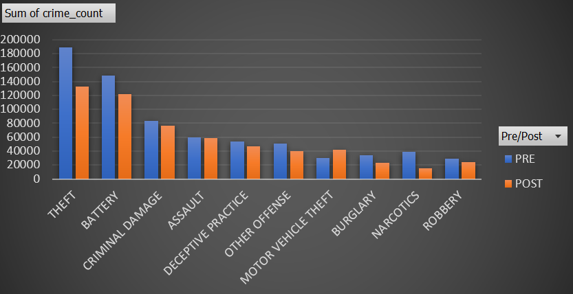
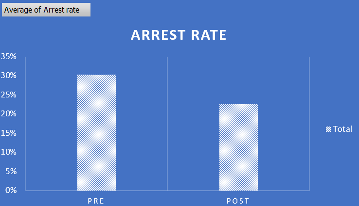
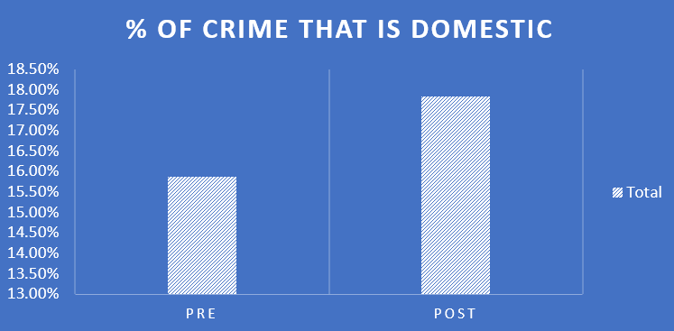

**Chicago Crime between 2017 to 2022**

The Chicago Crime data set is a very robust data set beginning in 2003-2023(rolling but dated to the date of the report.) The unfiltered data set is quite large nearing 8 million records across 22 variables.

[*"Feb. 11, 2020: Illinois becomes first state to test for new coronavirus" -Chicago Tribune*]{.underline}

[*"Feb. 28, 2022: Mask mandates end in most of Chicago and Illinois"-Chicago Tribune*]{.underline}

My hypothesis is that the climate of world events, job insecurity, lock downs, and state of distress from covid-19 had a direct impact and increase on crime beginning in 2020 through to the 2022 during the pandemic.

I will utilize the count of the crime instead of the general per-capita measurement due to the restrictions in the data. However, the census for Chicago shows a \~3% decrease in population in the Chicago area during the available 2020-2022 census.gov records. This would mean any INCREASE in crime would be even more significant. But for the sake of simplicity I will treat the population as a static and non variable during my analysis.


**My Hypothesis:**

H0: Covid lockdowns had no significant effect on crime during the years of shutdown 2020-2022 vs 2017-2019

Ha: There was a significant increase in crime during the years of shutdown 2020-2022 vs 2017-2019

**Import Library**

```{r}
library('tidyverse')
library('janitor')
```

```{r}
df = read.csv('C:/Users/Logan/Downloads/Chi_Crime.csv')
```

**Clean Column Headers**

```{r}
df <- df %>% clean_names()

```

**Variables I will drop and why.**

\>Case Number, FBI CODE,BEAT CODE,IUCR: Not Important ID data for me.

*location,x,y coords,block,District(police dist not ward), Community ID:*

I may want to do an analysis by WARD or Long Lat later on, the rest are not necessary for my anlysis.

updated on : not an important column for the analysis, also dropped.

```{r}
names(df)
```

```{r}
head(df)
df <- df %>% select(id,date,primary_type,description,location_description,arrest,domestic,ward,year,latitude,longitude)
```

Since I would potentially like to plot crime on the map I will remove nulls from these values they are a very small subset of the data. I also want to grab the years leading right before Covid-19 and onwards.

```{r}
df <-  df %>% filter(!is.na(latitude),!is.na(longitude),(year>2016 & year<2023))

```

Convert to Logical for arrest and domestic, format date time to bucket crime periods later on.

```{r}
df <- transform(df, arrest = as.logical(arrest),
          domestic = as.logical(domestic),
          date = as.POSIXct(date, format = "%m/%d/%Y %I:%M:%S %p"))
```

```{r}
df <- df%>%
      mutate(year_month=format(date, "%Y-%m"))
```

Final check for any Nulls, Looks Good (some nulls found in year-month not sure if I want to keep will validate later based on impact data)

```{r}
names(df)
```

create an aggregate dataframe to understand my hypothesis and data.

```{r}
ndf <- df%>%
  group_by(year_month,primary_type,ward)%>%
  dplyr::summarise(
    crime_count=n(),
    was_arrested_count=sum(arrest, na.rm = TRUE),
    was_domestic_count=sum(domestic, na.rm = TRUE)
    )

ndf
```

Store my cleaned data frames for ease of access later.

```{r}
write.csv(df, "C:/Users/Logan/Documents/GitHub/high_crime_chi_crime/2017-2022_Crime.csv", row.names=FALSE)
```

```{r}
write.csv(ndf, "C:/Users/Logan/Documents/GitHub/high_crime_chi_crime/2017-2022_Agg_Crime.csv", row.names=FALSE)
```

**Explore and Visualize the data:**

```{r}
df = read.csv("C:/Users/logan/Documents/GitHub/high_crime_chi_crime/2017-2022_Agg_Crime.csv")
df
```

replace dash in year_month to make a dbl value criteria for linear analysis and better charting.

```{r}
df <- df%>% transform(df,
                year_month=str_replace(year_month,'-','\\.'))


```

remove NA dates

```{r}
df <- df%>% transform(df,
                year_month=as.numeric(year_month))
df <- df%>% filter(year_month != "NA")
df
```

```{r}

#sum the counts of crime by bucket to get total crime by year-month
sdf <-  df%>%
  group_by(year_month)%>%
  dplyr::summarise(
    crime = sum(crime_count),
    arrests= sum(was_arrested_count),
    domestic= sum(was_domestic_count)
    )

sdf


```

general overview of the data in question

```{r}
ggplot(sdf,aes(x=year_month))+
  geom_line(aes(y = crime),color = "darkred") +
  geom_line(aes(y= arrests),color ="steelblue",linetype="twodash")+
  geom_line(aes(y= domestic),color ="orange",linetype="twodash")+
  labs(x="Years",y="Number of Occurences")

```

```{r}
cor(df$year_month,df$crime_count)
```

This is not at all what I expected to see in terms of crime over time has a negative relation to crime levels. However, recall we identified the numbers were not per-capita and that there was around a 3% decrease in total population in the Chicago Area during the pandemic, which is strikingly similar to the negative 3% correlation we see above. Without further analysis it would be incredibly safe to assume we cannot attribute rising crime levels to covid since the data can not even support the claim of crimes even changing in any significant manner.

I would have to **Fail to reject my Null Hypothesis** at this step without need of further analysis.

After doing additional visualizations in excel per the requirements of the capstone we can see the following interesting finds in the data.

**Crime by Category in Pre Post Covid Introduction to Chicago(Top 10):**



The only significant increase in crime category was motor theft but there was generally a decrease across all categories of crime in the Pre years(2017,2018,2019) vs the Post years (2020,2021,2022). I have two minds on this.

1.) The increase of in home isolation kept people off of the streets and the increase of funding for the unemployed reduced the need for crimes of desperation.

2.) Police Departments could have been understaffed or underfunded and were less able to report on department discovered crime.

The data set we have does not provide sufficient evidence to investigate either of these claims but I felt it was conjecture that would merit further investigation.

**Arrest per Crime in Pre-Post Covid Introduction to Chicago:**



We expected to see a decrease arrests due to a decrease in crime however, this metric is formed by the % of crime that ended with an arrest. Why the arrests went down I have two theories, one of which is unsupported by the data and one that is.

1.) Police would be less likely to arrest citizens during this time due to either more reported crimes that have less staff to investigate and arrest/act on **OR** a reluctance to incarcerate individuals at fear of risk to their health during a pandemic of a contagious disease.

(this point would be unable to be investigated with the provided data set)

2.) Due to an increase of forced isolation, there could also be an increase in domestic violence in the post era due to victims being in forced proximity of new abusers **OR** higher chance of occurrence of incidences of abuse of repeat offenders of domestic violence. We see this data evident in the chart below.



create changes needed to make t_tests

```{r}
sdf <- sdf %>% 
  mutate(
    perc_arrests= round((arrests/crime)*100,2),
    perc_domestic = round((domestic/crime)*100,2)
    )
sdf <- select(sdf,-arrests,-domestic)

```

We want to create a group Identifier to T Test the PRE and POST covid groups.

```{r}
#create a group for arrests, we want to t
sdf$group <-  ifelse(sdf$year_month<2020,1,2)

sdf
```

**NEW HYPOTHESIS:**

H0: Covid lockdowns had no significant effect on the average rate of domestic crime.

Ha: Covid lockdowns had a significant effect on the average rate of domestic crime.

```{r}
t.test(perc_domestic ~ group, sdf)
```

[Domestic Crime Rate Pre vs Post covid groups:]{.underline}

The T-value is -5, this tells us the means are 5 standard deviations apart. This is Significant.

The P-value is extremely small 8.14e-06 , which indicates the probability of observing such a large difference in the means is small. This is indicates a high statistical significance in the difference between the groups and thus we MUST reject the Null Hypothesis and be in favor of the Alternative hypothesis.

**CONCLUSIONS:**

Upon my initial examination of the dataset, I found myself influenced by my own predispositions, shaped by media commentaries and local government discussions. Consequently, I held the assumption that crime must have surged during the COVID-19 lockdown period spanning from 2020 to 2022. However, contrary to my expectations, there was no significant upswing in crime rates; in fact, there was a minor reduction. The correlation analysis for crime rates over this time span yielded approximately -0.0328, indicating a statistically inconsequential negative connection between the passage of years and the crime frequency.

Consequently, I failed to reject the null hypothesis on these grounds. In an ideal scenario, I would have employed a T-test, but the absence of data on a per capita basis rendered this approach unsuitable due to the potential for skewed results, possibly leading to a Type 1 error.

In contrast, my final hypothesis, which had an alternate hypothesis that they years during the COVID-19 had an insignificant increase due to prevailing conditions of the time, proved to be highly statistically significant and I was force to **reject the Null Hypothesis**. Although the reasons for this surge remain uncertain based solely on the available data, the evidence does reflect a notable increase.

Overall, my analysis of the data suggests that while the overall aggregate count of crimes decreased (without accounting for population changes), there was a noticeable rise in the incidence of domestic crimes. This could be attributed to the unfortunate circumstance of abuse victims being confined with their abusers, potentially giving rise to new instances of abuse due to the heightened stress prevailing during those trying times.
